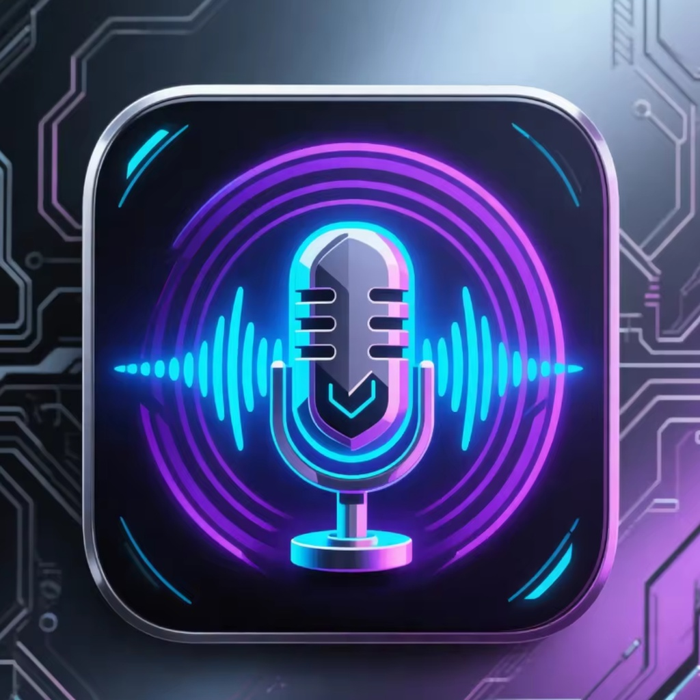

# Noisy Detector

An iOS SwiftUI app that finds the direction of the loudest sound by combining
microphone amplitude with the device's compass heading while the user turns
around 360°.

## Features
- Live sound level visualization (raw + smoothed)
- Radar-style direction display with compass labels (N/E/S/W)
- Polar "sound blob" visualization of sampled audio
- Top 3 loudest headings display
- Start/Stop scan flow with calibration step
- Scan progress indicator for the 360° sweep
- Scan quality indicator (too fast, too quiet, too noisy)
- Adaptive noise floor + EMA smoothing + high-pass filtering
- Gyro-based fast-rotation rejection
- Haptic feedback on start/stop/result
- Help screen with quick usage steps and tips
- Custom launch image on app start

## Requirements
- macOS with Xcode 15+ (or newer)
- iPhone with microphone + compass (magnetometer)
- iOS 15.0+

## Project Layout
- `NoisyDetector.xcodeproj` – Xcode project
- `NoisyDetector/` – App source code
  - `AudioDirectionManager.swift` – microphone + compass logic
  - `SoundRadarView.swift` – UI
  - `Info.plist` – permissions

## Permissions
The app requests:
- Microphone access to read sound levels
- Location access (When In Use) to read compass heading

## Quick Start
1. Open `NoisyDetector.xcodeproj` in Xcode.
2. Set your Development Team in Signing.
3. Run on a physical iPhone.
4. Tap **Start Scan**, rotate 360°, tap **Stop & Analyze**.

For full deployment steps, see `how_to_deploy.md`.

## Project Credits
Developer: Oleg Bourdo — https://www.linkedin.com/in/oleg-bourdo-8a2360139/

This project was created to support the Moon Home Agency initiative: https://moonhome.agency/
